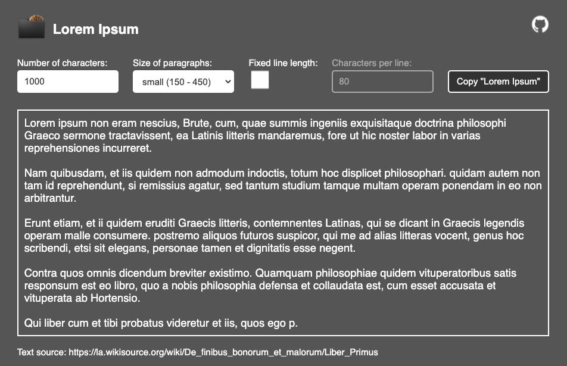

# Lorem ipsum generator

This is a lorem ipsum generator with an adjustable number of characters, four paragraph sizes and with a line length option.

## Options
- adjust number of characters from 1 to 49015
- use different paragraphs:
    - none
    - small (150 - 450 characters)
    - middle (450 - 750 characters)
    - big (750 - 1050 characters)
- set a fixed number of characters per line

## Hints
1. Setting a fixed line length will change the font to monospaced.
2. Due to accessibility the lorem ipsum display will not exceed the screen width even though the line could be longer.
When copying the lorem ipsum content with the copy button the set line length will be applied.

Text source: [la.wikisource.org/wiki/De_finibus_bonorum_et_malorum/Liber_Primus](https://la.wikisource.org/wiki/De_finibus_bonorum_et_malorum/Liber_Primus)
